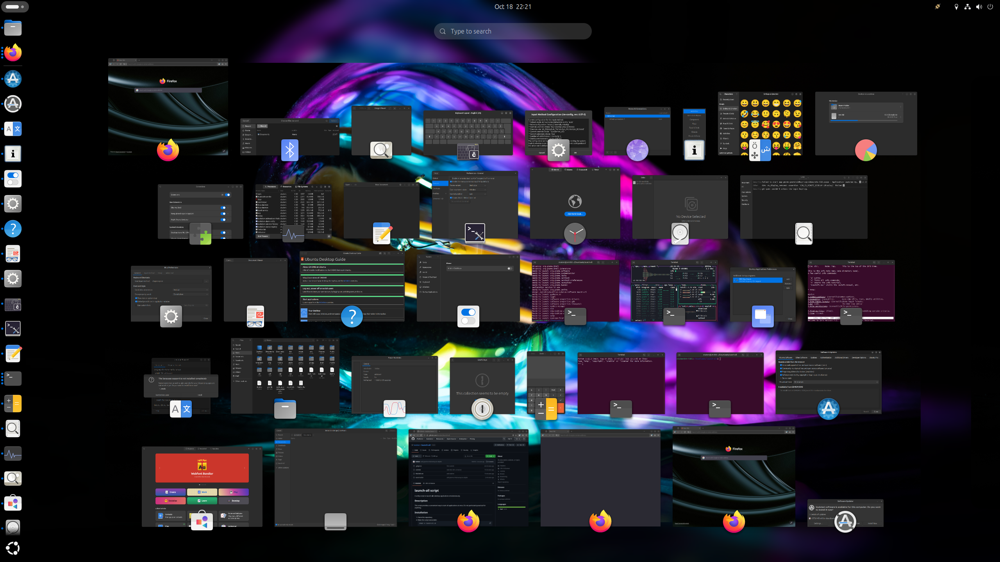

# launch-all script

A utility script to launch **all** `.desktop` applications simultaneously.

## Description

This script provides a convenient way to start all applications at once. It's not particularly practical for anything.

## Screenshots
The Gnome activity overview usually ends up looking like this:


## Inspiration
This script was inspired by [this reddit post](https://www.reddit.com/r/arch/comments/1o98xqs/woah/).

## Installation

1. Clone this repository
2. Make the script executable:
    ```bash
    chmod +x launch-all.sh
    ```

## Usage

```bash
./launch-all.sh
```

## Requirements

- Bash shell
- `gtk-launch` or `xdg-open` utilities
- The applications launched must have .desktop files in standard directories

## Contributing

Feel free to submit issues and enhancement requests.

## License

This project is licensed under the GNU General Public License version 3 License - see the LICENSE file for details.
